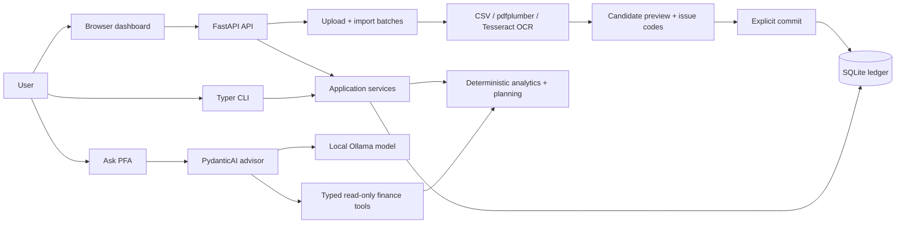

# Personal Finance Agent (PFA)

> Local-first personal finance intelligence: deterministic Python/SQLite calculations, optional local Ollama explanations, and browser/CLI statement import.

[](https://github.com/aafre/pfa/actions/workflows/ci.yml)

[](LICENSE)

PFA is a private personal finance app for people who want to import local bank statements, understand spending over time, track budgets and goals, and ask questions without sending financial data to hosted AI APIs. The key design rule is simple: **financial facts come from deterministic code; the model only interprets facts returned by typed tools.**



## Highlights

- **Local-first ledger** — SQLite is the source of truth; no hosted telemetry or cloud model requirement is implemented.
- **Deterministic finance engine** — income, spending, savings rate, budgets, goals, recurring evidence, anomalies, trends, and scenarios are calculated in Python from integer minor units.
- **Statement import studio** — upload CSV, HDFC India Delimited `.txt`, or PDF statements in the browser, preview extracted rows,
  review warnings/errors, exclude rows, state the statement's sign convention, and commit explicitly.
  Commit is blocked while any included row has a blocking error or the sign convention is unanswered.
- **PDF + OCR path** — digital PDFs use `pdfplumber`; scanned PDF pages can fall back to local Tesseract OCR when installed.
- **CLI, API, and dashboard** — Typer/Rich commands, FastAPI/OpenAPI endpoints, and a vanilla HTML/CSS/JS dashboard served by the same local app.
- **Bounded AI boundary** — optional PydanticAI advisor uses local Ollama with typed read-only tools and rejects financial-number answers that used no tool result.

## Quick start

Prerequisites:

- Python 3.12+
- [`uv`](https://docs.astral.sh/uv/)
- Optional: [Ollama](https://ollama.com/) for AI chat/classification
- Optional: Tesseract on `PATH` for scanned-PDF OCR

```bash
git clone https://github.com/aafre/pfa.git
cd pfa
uv sync

# Optional AI model; deterministic CLI/API workflows work without it.
ollama pull qwen3.5:4b

uv run pfa db migrate
uv run pfa import data/demo_transactions.csv
uv run pfa summary month --month 2026-08
```

Expected demo result on a fresh database:

```text
Imported 34; duplicates 0; requires classification 0
Income        GBP 3,500.00
Spending      GBP 3,110.99
Savings       GBP   400.00
Investments   GBP   300.00
Savings rate  20.00%
```

Start the local dashboard and API:

```bash
uv run uvicorn pfa.api.app:app --host 127.0.0.1 --port 8000
```

Then open:

- Dashboard: <http://127.0.0.1:8000/>
- OpenAPI docs: <http://127.0.0.1:8000/docs>

## What PFA can answer

After importing the demo ledger, useful commands include:

```bash
uv run pfa ask "Why was August more expensive than July?"
uv run pfa ask "What categories have increased over the last three months?"
uv run pfa ask "What recurring payments do I have?"
uv run pfa ask "Can I afford a £2,000 purchase without reducing planned monthly savings?"
uv run pfa review --month 2026-08
uv run pfa budget set 800 --category eating_out --month 2026-08 --discretionary
uv run pfa goals add "Emergency fund" 10000 --type emergency_fund
```

Common factual questions are answered deterministically without invoking a model. Broader natural-language questions use the local advisor when the configured Ollama model is available.

## How it works

1. **Import** a CSV/PDF statement through the CLI or browser.
2. **Extract** candidate rows locally with source line/page provenance.
3. **Validate** date, description, amount, direction, currency, kind, category, and transfer purpose.
4. **Deduplicate** with occurrence-aware fingerprints and external transaction IDs when present.
5. **Classify** with source fields, deterministic rules, user merchant rules, and finally the optional local classifier.
6. **Commit** reviewed rows to SQLite.
7. **Analyze** the ledger with deterministic analytics and planning services.
8. **Explain** results through CLI/API/dashboard; the AI advisor can only see small tool results, not arbitrary SQL or the whole database.

## Financial semantics

PFA is strict about money because small mistakes corrupt advice:

- Money is stored as integer minor units (`350000` = GBP 3,500.00).
- v0.1 is GBP-only and rejects other currencies instead of summing them.
- Spending = classified expenses + fees − refunds.
- Refunds reduce spending in the month the refund posts.
- Owned-account transfers are persisted for audit but excluded from income and spending.
- Savings rate = `(saving transfers + investment transfers) / income` for the period.
- For paired owned-account transfers, only the debit/outgoing side contributes to savings/investment totals.
- Cash withdrawals move bank cash to physical cash; they are not spending until the underlying purchase is classified.

## Statement ingestion

| Path | Supported now | Notes |
| --- | --- | --- |
| CLI | Local UTF-8 CSV files | `uv run pfa import <path.csv>`; `--dry-run` validates without persistence. |
| Browser/API preview | CSV, HDFC Delimited `.txt`, and PDF uploads | `POST /imports/preview` stages a bounded local upload, extracts candidates, and deletes raw uploaded bytes after extraction. |
| Digital PDF | Yes, best-effort | Uses `pdfplumber` table/word extraction with source-page provenance. |
| Scanned PDF | Basic local OCR fallback | Requires Tesseract installed on `PATH`; OCR-derived rows carry review warnings, and low-confidence date/amount fields block commit. |

Upload limits default to 15 MiB, 100 PDF pages, 10,000 candidate rows, and a 24-hour TTL for uncommitted normalized batches. Committed batches keep metadata and transaction IDs, not raw statement bytes.

CSV imports accept common aliases for date, description, amount, account, and transaction ID. They support signed `amount` columns, debit/credit columns, comma/semicolon/tab delimiters, UTF-8 BOM, row-level errors, duplicate detection, and manual review for unresolved classifications. HDFC India Delimited exports are content-detected from their exact seven-column header, require a confirmed INR Current/Savings account, and reconcile ordered closing balances before commit.

For unsigned credit-card-style exports, the preview API supports an explicit `amount_sign` patch (`as_written` or `debit_positive`) so PFA does not silently guess whether positive values are purchases or credits.

## CLI reference

```bash
uv run pfa db migrate
uv run pfa import data/demo_transactions.csv --dry-run
uv run pfa summary month --month 2026-08
uv run pfa transactions list --limit 25
uv run pfa transactions uncategorized
uv run pfa transactions correct 123 --category groceries
uv run pfa budget show --month 2026-08
uv run pfa goals list
uv run pfa health
uv run pfa eval-classifier  # requires the configured Ollama model
```

## HTTP API

Run the API with Uvicorn, then use `/docs` for the generated OpenAPI UI.

| Method | Path | Purpose |
| --- | --- | --- |
| `GET` | `/` | Browser dashboard |
| `GET` | `/health` | Application, database, Ollama, and configured-model status |
| `POST` | `/imports/preview` | Multipart CSV/PDF upload and candidate preview |
| `GET` | `/imports/{batch_id}` | Fetch an unexpired import batch |
| `PATCH` | `/imports/{batch_id}` | Change destination account, inclusion list, or sign convention |
| `POST` | `/imports/{batch_id}/commit` | Atomically commit included non-duplicate candidates |
| `DELETE` | `/imports/{batch_id}` | Discard an uncommitted batch |
| `POST` | `/imports` | Deprecated server-local CSV path import |
| `GET` | `/accounts` | Accounts in the ledger |
| `GET` | `/transactions` | Recent transactions |
| `GET` | `/analytics/monthly` | Monthly summary for `?month=YYYY-MM` |
| `GET` | `/analytics/categories` | Category spending for `?month=YYYY-MM` |
| `GET` | `/budgets` | Budget status for `?month=YYYY-MM` |
| `GET` | `/goals` | Active goal progress |
| `POST` | `/scenarios/purchase` | Purchase affordability scenario |
| `POST` | `/chat` | Deterministic answer or local-model advisor answer |
| `GET` | `/reviews/monthly` | Monthly review evidence |

Minimal examples:

```bash
curl "http://127.0.0.1:8000/analytics/monthly?month=2026-08"

curl -F "file=@data/demo_transactions.csv" \
  "http://127.0.0.1:8000/imports/preview"
```

## Configuration

PFA reads `.env` through `pydantic-settings` with the `PFA_` prefix. Defaults are local.

| Variable | Default | Purpose |
| --- | --- | --- |
| `PFA_DATABASE_URL` | `sqlite:///data/pfa.db` | SQLite ledger location. |
| `PFA_OLLAMA_BASE_URL` | `http://localhost:11434` | Local Ollama server. |
| `PFA_MODEL` | `qwen3.5:4b` | Ollama model used by advisor/classifier. |
| `PFA_LOG_LEVEL` | `INFO` | Application log level. |
| `PFA_AGENT_RETRIES` | `1` | PydanticAI retry count. |
| `PFA_AGENT_TOOL_TIMEOUT_SECONDS` | `20` | Tool-call timeout. |
| `PFA_AGENT_REQUEST_TIMEOUT_SECONDS` | `60` | Model request timeout. |
| `PFA_AGENT_REQUEST_LIMIT` | `8` | Maximum model requests per run. |
| `PFA_AGENT_OUTPUT_TOKEN_LIMIT` | `1024` | Maximum model output tokens. |
| `PFA_UPLOAD_DIR` | `data/uploads` | Temporary upload staging directory. |
| `PFA_MAX_UPLOAD_BYTES` | `15728640` | Upload size cap. |
| `PFA_MAX_CANDIDATE_ROWS` | `10000` | Candidate-row cap per import. |
| `PFA_IMPORT_BATCH_TTL_HOURS` | `24` | Uncommitted batch retention. |
| `PFA_EXTRACTION_TIMEOUT_SECONDS` | `60` | Statement extraction timeout. |
| `PFA_MAX_PDF_PAGES` | `100` | PDF page cap. |
| `PFA_OCR_ENABLED` | `true` | Enable page-selective OCR fallback. |
| `PFA_OCR_LANGUAGE` | `eng` | Tesseract language code. |
| `PFA_OCR_DPI` | `300` | Render resolution for OCR pages. |
| `PFA_OCR_TIMEOUT_SECONDS` | `30` | Tesseract subprocess timeout. |
| `PFA_OCR_MIN_CONFIDENCE` | `80` | Low-confidence threshold for OCR financial fields. |

To customize defaults:

```bash
cp .env.example .env
# PowerShell: Copy-Item .env.example .env
```

## Project structure

```text
src/pfa/
├── api/          FastAPI app, dashboard serving, upload/import/chat routes
├── ai/           Ollama-backed PydanticAI advisor, classifier, typed tools
├── analytics/    Monthly summaries, category totals, trends, anomalies, recurring evidence
├── cli/          Typer/Rich command-line interface
├── db/           SQLAlchemy models, repositories, sessions, unit of work
├── domain/       Money, transaction, account, budget, and goal rules
├── ingestion/    CSV/PDF/OCR extractors, candidates, batches, dedupe, import service
├── planning/     Purchase and monthly-contribution scenario calculations
├── services/     Runtime composition, deterministic answers, health, reviews
└── web/          Vanilla dashboard HTML/CSS/JS
```

Other important paths:

```text
alembic/          Production schema migrations
data/demo_transactions.csv
docs/architecture.md
docs/ai-engineering.md
evals/classifier.py
tests/
```

## Development

```bash
uv sync
uv run pfa db migrate
uv run ruff check .
uv run ruff format --check .
uv run mypy src
uv run pytest
uv build --no-sources
```

CI runs locked dependency install, Ruff, format check, strict mypy, pytest, and package build on Python 3.12.

The normal test suite does not call Ollama. `uv run pfa eval-classifier` is a separate four-case structured-output compatibility smoke that requires the configured local model; it is not a production model-quality benchmark.

## Privacy, safety, and limitations

- The advisor is advisory and its tools are read-only. PFA can update its local ledger through explicit import/correction/budget/goal commands, but it cannot transfer money, place trades, initiate payments, alter external bank accounts, or promise investment returns.
- The API is intentionally unauthenticated and intended for localhost (`127.0.0.1`), not direct internet exposure.
- Browser upload accepts `.csv` and `.pdf`; images and other file types are rejected.
- Generic PDF extraction is best-effort and does not guarantee support for every bank layout.
  Against a real corpus (HSBC current account, HSBC Visa, American Express) no PDF statement yet
  imports end to end; see [real-statement findings](docs/plans/2026-08-29-real-statement-extraction-findings.md).
  Treat browser PDF import as work in progress, not a supported path.
- Statements whose amounts are all unsigned positives (typical of credit-card exports) require an
  explicit sign convention before commit. PFA never infers it: an all-positive statement is genuinely ambiguous.
- Password-protected PDFs are rejected.
- Scanned PDFs require local Tesseract; low-confidence OCR for dates/amounts blocks commit until the row is fixed or excluded.
- Browser preview currently supports account assignment and row exclusion; committed ledger editing is not implemented in the dashboard.
- Opening balances, credit-card payment matching, multi-currency aggregation, automatic deferred reclassification, and broad grounded-answer evals are not implemented.
- Recurring/anomaly detection is heuristic and should be treated as evidence to inspect, not a guarantee.

## Documentation

- [Architecture](docs/architecture.md)
- [AI engineering notes](docs/ai-engineering.md)
- [Statement upload and PDF extraction requirements](docs/plans/2026-08-28-statement-upload-pdf-extraction-design.md)

## Contributing

There is no separate `CONTRIBUTING.md` yet. For now:

1. Create a feature branch.
2. Keep financial calculations deterministic and covered by tests.
3. Run the development checks above.
4. Open a pull request with the behavior change and validation notes.

## License

MIT — see [LICENSE](LICENSE).
