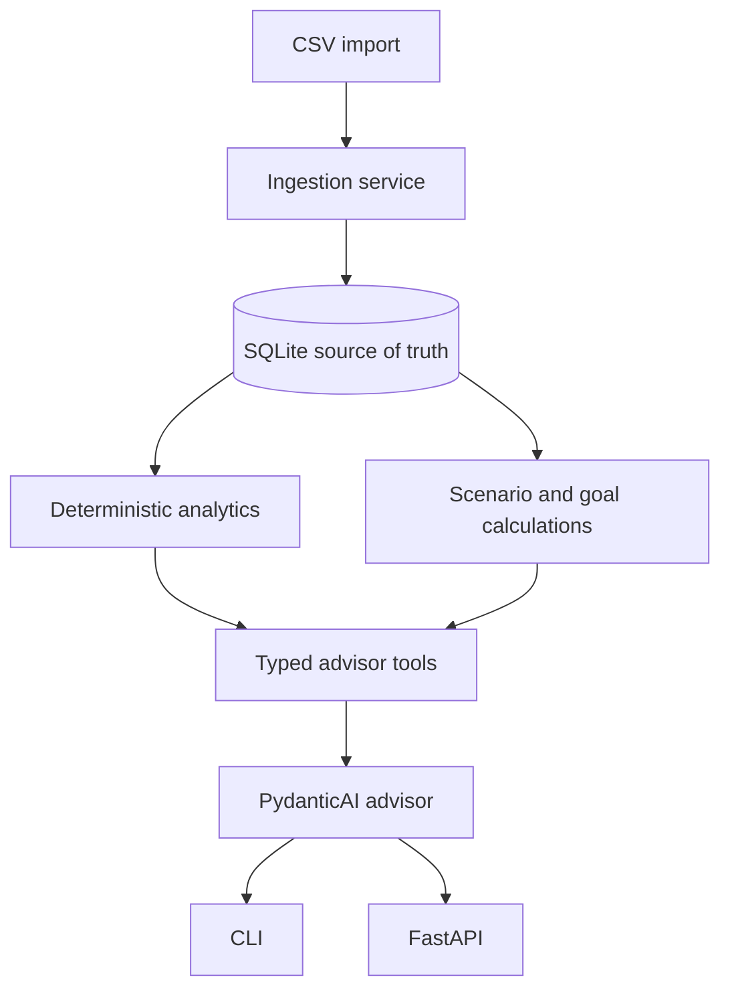

# PFA architecture

PFA is a local-first application with one authoritative financial state: the SQLite database.
The model can interpret questions and choose narrow read-only tools, but it never receives the
whole database and never calculates financial facts.

## Boundaries

- `domain` contains enums, money rules, and small value objects.
- `db` owns SQLAlchemy models, sessions, and repository access.
- Alembic migrations are the authoritative production schema path. Runtime service creation never
  creates or upgrades tables; run `pfa db migrate` before using CLI or API workflows.
- `ingestion` parses and validates source rows, deduplicates, then classifies.
- `analytics` calculates facts from typed transaction records.
- `planning` calculates projections from explicit assumptions.
- `services` coordinates workflows without exposing ORM objects to callers.
- `ai` provides local Ollama integration and read-only tools over services.
- `cli` and `api` are presentation/composition layers.

Transactions retain the legacy absolute `amount_minor` plus `flow_direction` (`debit`/`credit`)
for storage compatibility. The canonical economic polarity is `signed_minor`: positive is money
into the account's net-worth contribution and negative is money out. It is derived as
`amount_minor` for `credit`, otherwise `-amount_minor`; source CR/DR markers and transaction kind
(expense, income, refund, or transfer) are separate concepts. Analytics consumes canonical signs,
not accounting debit/credit terminology.

Accounts have stable IDs and an explicit type. `current`, `savings`, and `cash` are liquid assets;
`investment` is an illiquid asset; `credit_card` and `loan` are liabilities. Opening balances are
natural account balances and are dated as end-of-day baselines. Liquid cash includes only canonical
signed movements strictly after that baseline and is marked incomplete when a baseline is missing.

Transfers between owned accounts are persisted for auditability but excluded from income and
spending. Savings and investment transfers are separately tagged so wealth-building metrics do
not become ordinary consumption. Card repayments use `credit_card_payment` and count once from
the positive card leg as debt repayment; interest and fees remain debt costs.

## Deliberate constraints

SQLite, local Ollama, one advisor agent, and deterministic retrieval are enough for the first
version. No cloud telemetry, hosted model, vector database, broker integration, or transaction
execution is required. The API is intended for localhost and does not add unnecessary auth.
