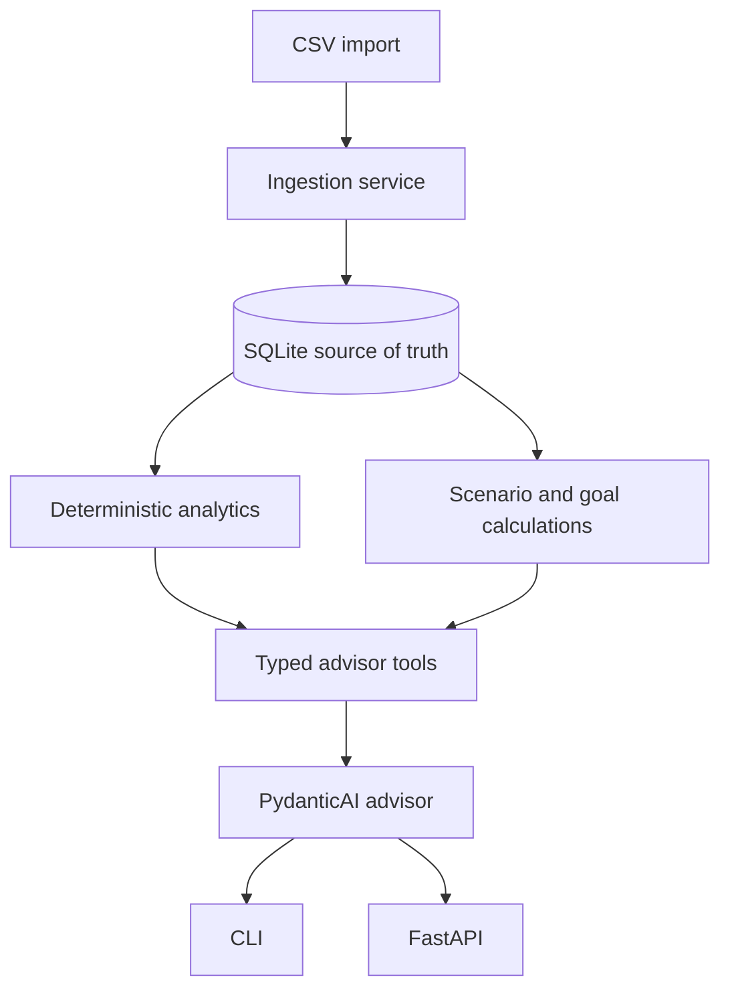

# PFA architecture

PFA is a local-first application with one authoritative financial state: the SQLite database.
The model can interpret questions and choose narrow read-only tools, but it never receives the
whole database and never calculates financial facts.

## Boundaries

- `domain` contains enums, money rules, and small value objects.
- `db` owns SQLAlchemy models, sessions, and repository access.
- `ingestion` parses and validates source rows, deduplicates, then classifies.
- `analytics` calculates facts from typed transaction records.
- `planning` calculates projections from explicit assumptions.
- `services` coordinates workflows without exposing ORM objects to callers.
- `ai` provides local Ollama integration and read-only tools over services.
- `cli` and `api` are presentation/composition layers.

Transfers between owned accounts are persisted for auditability but excluded from income and
spending. Savings and investment transfers are separately tagged so wealth-building metrics do
not become ordinary consumption.

## Deliberate constraints

SQLite, local Ollama, one advisor agent, and deterministic retrieval are enough for the first
version. No cloud telemetry, hosted model, vector database, broker integration, or transaction
execution is required. The API is intended for localhost and does not add unnecessary auth.
